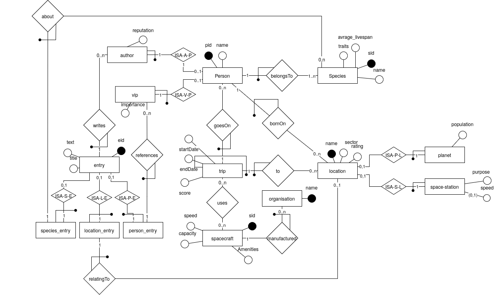

# Introduction to Databases Project

The project aims to be a simplified version of the The Hitchhiker's Guide to the Galaxy

The project was build starting from prof. Cavaleses [project requirements](https://www.inf.unibz.it/~calvanese/teaching/24-25-idb/#project).

## Specification: The HHGTTG Repository 
We are interested in the Guide that contains entries helpful for navigating the universe, such entries have to be divided in the entries regarding VIPs (Arthur Dent: A confused Earthman who found himself rather unexpectedly thrust into galactic adventures. Entry notes: “Mostly in search of tea and a decent sandwich.”), entries regarding planets ("Earth: Mostly harmless. Except for the moments when it isn’t. Known for its bizarre obsession with paperwork and reality TV."), entries regarding species (Vogon Poetry: The third worst poetry in the universe. Exposure to it can cause extreme nausea, loss of will to live, and in extreme cases, spontaneous self-combustion) and general entries (Towel: The single most massively useful thing an interstellar hitchhiker can carry. It can be used for warmth, defense, signaling, or even as a makeshift flotation device. Most importantly, it makes you look like you know what you're doing). Only approved Authors with a high enough reputation, may add entries to the Guide. Authors. VIPs, who are generally famous persons and not only authors may be given a score, to quickly identify how important they are eg. the president of the galaxy scould have a high score. In addition, we are interested in the travelers using our guide, which may rate the location they visited on a scale from 0 to 100, can rate a location more then once providet at least one 30 standard days passed since the last visit. We need also the time  We are also interested in the Spacecraft they use to travel, in particular how many people it transportred, the amenities of the veichle, and the name of the organizations that produce such spacecraft. We want to know the planet of origin of the travelers, the species they belong to and which planets they visited,

## Structured and organized requirements

1. **Guide Entries Management**  
   - The system must manage a repository of entries that provide useful information for navigating the universe.  
   - The system must classify each entry into one of the following categories:  
     - VIP entries (for important or famous persons)  
     - Planet entries  
     - Species entries  
     - General entries  

2. **Authorship and Approval**  
   - The system must restrict the ability to add new entries to approved authors only.  
   - Approval must be based on criteria ensuring the author’s suitability to contribute to the Guide.

3. **VIPs**  
   - The system must identify VIPs as persons who hold a notable status (e.g., public figures, high-ranking officials, etc.).  
   - The system must allow for a measure of importance or significance to be assigned to VIPs.

4. **Travelers and Visits**  
   - The system must keep track of travelers who make use of the Guide.  
   - The system must record each traveler's visits to various locations across the universe.
   - The system must record the planet of origin for each traveler.

5. **Ratings and Constraints**  
   - The system must allow travelers to evaluate or rate a location after visiting it (from 0 to 100).  
   - The system must ensure that a traveler can submit multiple ratings for the same location only if certain temporal conditions are met.

6. **Spacecraft**  
   - The system must keep track of the spacecraft used by travelers for their journeys.  
   - The system must record details about the organizations responsible for producing these spacecraft.

7. **Species and Origin**  
   - The system must record the species to which each traveler belongs.  
   - The system must track the planet of origin for each traveler.

8. **Planetary Information**  
   - The system must maintain information about the planets in the universe.  
   - The system must track which travelers have visited which planets.

9. **Temporal Tracking**  
   - The system must handle the notion of time and ensure time-related rules (e.g., intervals between ratings) are enforced.  

## common operations

Below are five of the most common operations that the system is expected to perform:

1. **Adding a New Guide Entry**  
   - Verify that the contributor is an approved author.  
   - Insert a new entry into the `Entry` table.  
   - Classify the entry by inserting a corresponding record into one of the classification tables (`PersonEntry`, `LocationEntry`, or `SpeciesEntry`).

2. **Recording a Traveler's Trip**  
   - insert a new record into the `Trip` table to represent a traveler's journey.

3. **Submitting a Location Rating**  
   - Allow a traveler to rate a location (e.g., a planet or space station) after a visit.  
   - Ensure that at least 30 standard days have passed since the traveler's last rating for the same location before accepting a new rating.  
   - Update the location's rating accordingly.

4. **Managing Spacecraft Usage**  
   - Track which spacecraft a traveler uses during a trip.  
   - Capture spacecraft details such as `name`, `capacity`, `amenities`, and the associated manufacturing `organisation`. 

5. **Querying and Retrieving Guide Information**  
   - Retrieve entries based on various criteria (e.g., by category: VIP, planet, species, or general).  
   - Enable filtering of entries by attributes like ratings, author, or related location.  
   - Support navigation and discovery functions within the guide for both end-users and administrators.

### glossary 
| term   | description | synonym | connections |
| ------ | ----------- | ------- | ----------- |
| person | persons travel, write articles andor are VIPs | individual | spicies, location, spacecraft |
| location | planets, stars, space stations | place | person, organisation |
| spicies | spicies of persons | race | person, location |
| organisation | organisations that produce spacecraft | company | spacecraft |
| spacecraft | spacecraft used by persons | ship | person, organisation, location |
| entry | entries in the guide | article | author |
| author | authors of entries | writer | entry, person |
| vip | very important person | important person | person, person_entry |
| person_entry | rating of a person | rating | vip, entry |
| location_entry | rating of a location | rating | location, entry |
| spiceis_entry | rating of a spicies | rating | spicies, entry |
| planet | planets in the universe | world | location |
| space_station | space stations in the universe | station | location |

### diagram of the conceptual schema

### data dictionary
| **Entity**       | **Description**         | **Attributes**            | **Identifier(s)**                 |
|------------------|--------------------------------------------------------------------------------- |-------------------------------------------------------|----------------------------------- |
| **Entry**        | A guide entry that provides useful information for navigating the universe.      | `ied`, `title`, `text`                        | `ied`                                      |
| **Person**       | An individual in the system (e.g., traveler, author, VIP).                       | `pid`, `name`                                 | `pid`                                      |
| **Location**     | A physical location in the universe (can be a planet or a space station).        | `name`, `sector`, `rating`                    | `name`                                     |
| **Organisation** | An organization responsible for producing spacecraft.                            | `name`                                        | `name`                                     |
| **Spacecraft**   | A vehicle used by travelers for journeys.                                        | `name`, `capacity`, `amenities`, `speed`      | `name`                                     |
| **Species**      | A biological species in the universe.                                            | `sid`, `name`, `traits`, `average_lifespan`   | `sid`                                      |
| **Trip**         | A travel event representing a journey with an evaluation score and duration.     | `startDate`, `endDate`, `person`, `score`     | Composite: `(startDate, endDate, person)`  |
| **Author**       | An approved contributor who can add new entries to the Guide.                    | `id`, `reputation`                            | `id`                                       |
| **Vip**          | A person with notable status (e.g., public figure, high-ranking official).       | `id`, `importance`                            | `id`                                       |                          
| **PersonEntry**  | Marks an entry as a person-related entry.                                        | `entry`                                       | `entry`                                    |
| **LocationEntry**| Marks an entry as a location-related entry.                                      | `entry`                                       | `entry`                                    |
| **SpeciesEntry** | Marks an entry as a species-related entry.                                       | `entry`                                       | `entry`                                    |
| **Planet**       | Information about a planet; a subset of `Location`.                              | `name`, `population`                          | `name`                                     |
| **SpaceStation** | Information about a space station; a subset of `Location`.                       | `name`, `purpose`, `speed*`                   | `name`                                     |

| **Relationship** | **Description**                                                                                     | **Components**                                     | **Attributes** | **Identifier(s)**                          |
|------------------|-----------------------------------------------------------------------------------------------------|----------------------------------------------------|----------------|--------------------------------------------|
| **about**        | Associates an entry with the species it is about.                                                   | `entry`, `species`                                 | None           | implicit |
| **writes**       | Indicates that an author wrote a given entry.                                                       | `entry`, `author`                                  | None           | implicit |
| **references**   | Indicates that an entry references a VIP.                                                           | `entry`, `vip`                                     | None           | implicit |
| **relatingTo**   | Associates an entry with a location it is related to.                                               | `entry`, `location`                                | None           | implicit |
| **belongsTo**    | Indicates that a person belongs to a specific species.                                              | `person`, `species`                                | None           | implicit |
| **goesOn**       | Indicates that a person embarks on a trip.                                                          | `person`, `startDate`, `endDate`                   | None           | implicit |
| **uses**         | Indicates that a person uses a particular spacecraft during a trip.                                 | `person`, `spacecraft`, `startDate`, `endDate`     | None           | implicit |
| **to**           | Indicates that a person travels to a specific location as part of a trip.                           | `person`, `location`, `startDate`, `endDate`       | None           | implicit |
| **bornOn**       | Specifies the planet on which a person was born.                                                    | `person`, `planet`                                 | None           | implicit |
| **manufactured** | Associates a spacecraft with the organisation that manufactured it.                                 | `spacecraft`, `organisation`                       | None           | implicit |

### table of volumes and table of operations according to the foreseen application load

### table of volumes
| **Concept**       | **Construct** | **Volume** |
|-------------------|---------------|------------|
| **Entry**         | `Entity`      | 1,000,000  |
| **Person**        | `Entity`      | 100,000    |
| **Location**      | `Entity`      | 10,000     |
| **Organisation**  | `Entity`      | 100        |
| **Spacecraft**    | `Entity`      | 1,000      |
| **Species**       | `Entity`      | 1,000      |
| **Trip**          | `Entity`      | 1,000,000  |
| **Author**        | `Entity`      | 1,000      |
| **Vip**           | `Entity`      | 10,000     |
| **PersonEntry**   | `Entity`      | 10,000     |
| **LocationEntry** | `Entity`      | 100,000    |
| **SpeciesEntry**  | `Entity`      | 10,000     |
| **Planet**        | `Entity`      | 5,000      |
| **SpaceStation**  | `Entity`      | 5,000      |
| **writes**        | `Relationship`| 1,000,000  |
| **about**         | `Relationship`| 10,000     |
| **references**    | `Relationship`| 10,000     |
| **relatingTo**    | `Relationship`| 100,000    |
| **belongsTo**     | `Relationship`| 100,000    |
| **goesOn**        | `Relationship`| 1,000,000  |
| **uses**          | `Relationship`| 1,000,000  |
| **to**            | `Relationship`| 1,000,000  |
| **bornOn**        | `Relationship`| 100,000    |
| **manufactured**  | `Relationship`| 1,000      |

### table of operations
| **Operation**               | **Description**                      | **Frequency** |
|-----------------------------|----------------------                |---------------|
| **Add New Entry**           | Add a new guide entry                | 1/day         |
| **Record Traveler's Trip**  | Record a traveler's trip             | 100/day       |
| **Submit Location Rating**  | Allow a traveler to rate a location  | 10/day        |
| **Manage Spacecraft Usage** | Track spacecraft usage               | 1/day         |
| **Query Guide Information** | Retrieve guide entries               | 1,000/day     |

### Restructured conceptual scema

### external constraints

1. Each instance of Entry partecipates to at most one of the relationships ISA-L-E or ISA-P-E or ISA-S-E
2. Each instance of Location partecipates to exactly one of the relationships ISA-S-L, ISA-P-L
3. In each instance of Trip startDate must be erlier than endDate
4. the rating in Trip and location must be between 0 and 100

### translation
Entry(<u>ied</u>, title, text)

Person(<u>pid</u>, name)

Location(<u>name</u>, sector, rating)
Organisation(<u>name</u>)

Spacecraft(<u>name</u>, capacity, amenities, speed)

Species(<u>sid</u>, name, traits, avrage_lifespan)

Trip(<u>startDate</u>, <u>endDate</u>, <u>person</u>, score) \
Foreign key: Trip[person] $\subseteq$ Person[pid] \
Foreign key: Trip[location] $\subseteq$ Location[name]

Author(<u>id</u>, reputation) \
Foreign key: Author[id] $\subseteq$ Person[pid]

Vip(<u>id</u>, importance) 
Foreign key: Vip[id] $\subseteq$ Person[pid]

PersonEntry(<u>entry</u>) \
Foreign key: PersonEntry[entry] $\subseteq$ Entry[ied]

LocationEntry(<u>entry</u>) \
Foreign key: LocationEntry[entry] $\subseteq$ Entry[ied]

SpeciesEntry(<u>entry</u>) \
Foreign key: SpeciesEntry[entry] $\subseteq$ Entry[ied]

Planet(<u>name</u>, population) \
Foreign key: Planet[name] $\subseteq$ Location[name]

SpaceStation(<u>name</u>, purpose, speed*) \
Foreign key: SpaceStation[name] $\subseteq$ Location[name]

about(<u>entry</u>, species) \
Foreign key: about[entry] $\subseteq$ Entry[ied] \
Foreign key: about[species] $\subseteq$ Species[sid] \

writes(<u>entry</u>, author) \
Foreign key: writes[entry] $\subseteq$ Entry[ied] \
Foreign key: writes[author] $\subseteq$ Author[id]

references(<u>entry</u>, vip) \
Foreign key: references[entry] $\subseteq$ Entry[ied] \
Foreign key: references[vip] $\subseteq$ Vip[id]

relatingTo(<u>entry</u>, location) \
Foreign key: relatingTo[entry] $\subseteq$ Entry[ied] \
Foreign key: relatingTo[location] $\subseteq$ Location[name]

belongsTo(<u>person</u>, species) \
Foreign key: belongsTo[person] $\subseteq$ Person[pid] \
Foreign key: belongsTo[species] $\subseteq$ Species[sid]

goesOn(<u>person</u>, <u>startDate</u>, <u>endDate</u>) \
Foreign key: goesOn[person] $\subseteq$ Person[pid] \
Foreign key: goesOn[startDate] $\subseteq$ Trip[startDate] \
Foreign key: goesOn[endDate] $\subseteq$ Trip[endDate]

uses(<u>person</u>, <u>spacecraft</u>, <u>startDate, endDate</u>) \
Foreign key: uses[person] $\subseteq$ Trip[person] \
Foreign key: uses[spacecraft] $\subseteq$ Spacecraft[name] \
Foreign key: uses[startDate] $\subseteq$ Trip[startDate] \
Foreign key: uses[endDate] $\subseteq$ Trip[endDate]

to(<u>person</u>, location, <u>startDate, endDate</u>) \
Foreign key: to[person] $\subseteq$ Trip[person] \
Foreign key: to[location] $\subseteq$ Trip[startDate] \
Foreign key: to[endDate] $\subseteq$ Trip[endDate]

bornOn(<u>person</u>, planet) \
Foreign key: bornOn[person] $\subseteq$ Person[pid] \
Foreign key: bornOn[planet] $\subseteq$ Planet[name]

manufactured(<u>spacecraft</u>, organisation) \
Foreign key: manufactured[spacecraft] $\subseteq$ Spacecraft[name] \
Foreign key: manufactured[organisation] $\subseteq$ Organisation[name]

### external constraints
- Spacestation[name] $\cap$ Planet[name] = $\emptyset$ 
- Location[name] $\subseteq$ Planet[name] $\cup$ Spacestation[name]
- LocationEntry[entry] $\cap$ SpeciesEntry[entry] $\cap$ PersonEntry[entry]= $\emptyset$ 
- Trip[startDate] $<$ Trip[endDate]
- the rating in Trip and location must be between 0 and 100

#### restructuring of the relation schema

We merge most  (1,1) to (0/1,n) relationships into the entity they are connected to reduce the complexity of the schema.

Entry(<u>ied</u>, title, text, author) \
FK: Entry[author] $\subseteq$ Author[id]

Person(<u>pid</u>, name, species, bornon) \
FK: Person[species] $\subseteq$ Species[sid], Person[bornon] $\subseteq$ Location[name]

Location(<u>name</u>, sector, rating)

Organisation(<u>name</u>)

Spacecraft(<u>name</u>, capacity, amenities, organisation)
FK: Spacecraft[organisation] $\subseteq$ Organisation[name]

Species(<u>sid</u>, name, traits, avrage_lifespan)

Trip(<u>startDate</u>, <u>endDate</u>, <u>person</u>, location, score) \
Foreign key: Trip[person] $\subseteq$ Person[pid] \
Foreign key: Trip[location] $\subseteq$ Location[name]

Author(<u>id</u>, reputation) \
Foreign key: Author[id] $\subseteq$ Person[pid]

Vip(<u>id</u>, importance) 
Foreign key: Vip[id] $\subseteq$ Person[pid]

PersonEntry(<u>entry</u>, vip) \
Foreign key: PersonEntry[entry] $\subseteq$ Entry[ied], PersonEntry[vip] $\subseteq$ Vip[id]

LocationEntry(<u>entry</u>, location) \
Foreign key: LocationEntry[entry] $\subseteq$ Entry[ied], LocationEntry[location] $\subseteq$ Location[name]

SpeciesEntry(<u>entry</u>, species) \
Foreign key: SpeciesEntry[entry] $\subseteq$ Entry[ied], SpeciesEntry[species] $\subseteq$ Species[sid]

Planet(<u>name</u>, population) \
Foreign key: Planet[name] $\subseteq$ Location[name]

SpaceStation(<u>name</u>, purpose, speed*) \
Foreign key: SpaceStation[name] $\subseteq$ Location[name]

uses(<u>person</u>, <u>spacecraft</u>, <u>startDate, endDate</u>) \
Foreign key: uses[person] $\subseteq$ Trip[person] \
Foreign key: uses[spacecraft] $\subseteq$ Spacecraft[name] \
Foreign key: uses[startDate] $\subseteq$ Trip[startDate] \
Foreign key: uses[endDate] $\subseteq$ Trip[endDate]

### external constraints
- Spacestation[name] $\cap$ Planet[name] = $\emptyset$ 
- Location[name] $\subseteq$ Planet[name] $\cup$ Spacestation[name]
- LocationEntry[entry] $\cap$ SpeciesEntry[entry] $\cap$ PersonEntry[entry]= $\emptyset$ 
- Trip[startDate] $<$ Trip[endDate]
- the rating in Trip and location must be between 0 and 100