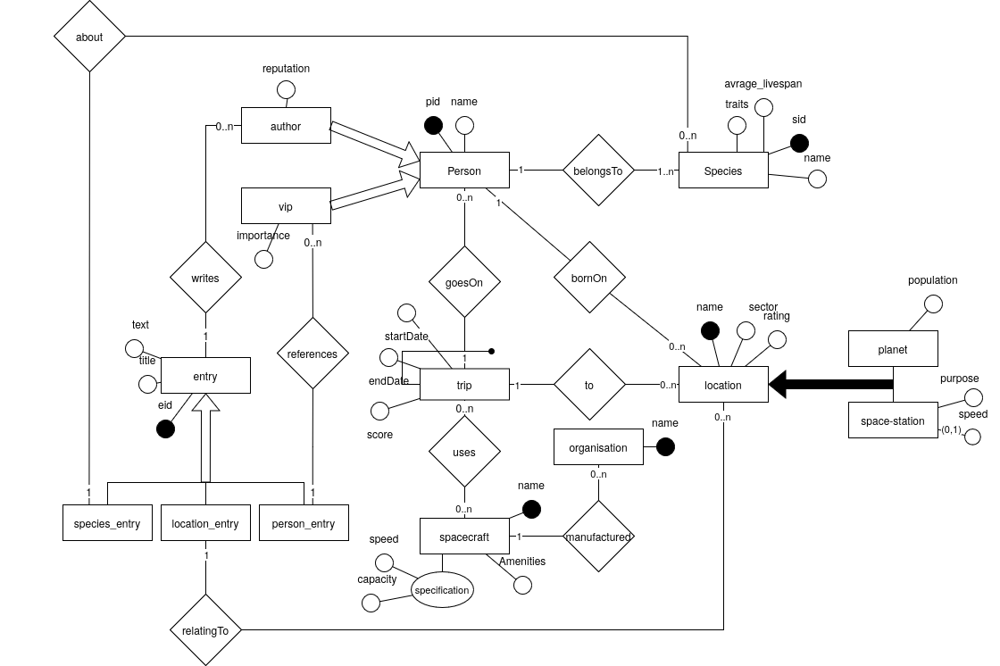

# Introduction to Databases Project

The project aims to be a simplified version of the The Hitchhiker's Guide to the Galaxy

The project was build starting from prof. Cavaleses [project requirements](https://www.inf.unibz.it/~calvanese/teaching/23-24-idb/#project).

## application domain

### The HHGTTG Repository 
We are interested in the Guide that contains entries helpful for navigating the universe, such entries have to be divided in the entries regarding VIPs (Arthur Dent: A confused Earthman who found himself rather unexpectedly thrust into galactic adventures. Entry notes: “Mostly in search of tea and a decent sandwich.”), entries regarding planets ("Earth: Mostly harmless. Except for the moments when it isn’t. Known for its bizarre obsession with paperwork and reality TV."), entries regarding species (Vogon Poetry: The third worst poetry in the universe. Exposure to it can cause extreme nausea, loss of will to live, and in extreme cases, spontaneous self-combustion) and general entries (Towel: The single most massively useful thing an interstellar hitchhiker can carry. It can be used for warmth, defense, signaling, or even as a makeshift flotation device. Most importantly, it makes you look like you know what you're doing). Only approved Authors with a high enough reputation, may add entries to the Guide. Authors. VIPs, who are generally famous persons and not only authors may be given a score, to quickly identify how important they are eg. the president of the galaxy scould have a high score. In addition, we are interested in the travelers using our guide, which may rate the location they visited on a scale from 0 to 100, can rate a location more then once providet at least one 30 standard days passed since the last visit. We need also the time  We are also interested in the Spacecraft they use to travel, in particular how many people it transportred, the amenities of the veichle, and the name of the organizations that produce such spacecraft. We want to know the planet of origin of the travelers, the species they belong to and which planets they visited,

### requirements

1. It should be based on a domain containing between 6 and 10 main conceptual entities (i.e., without counting sub-entities that appear in ISAs or generalizations).
2. There should be some structure in the set of entities, i.e., the ER schema should in addition contain at least one ISA and at least one generalization.
3. There should be sufficient structure in the relationships, which usually means that the representation of the ER schema as a graph (where the nodes are given by the entities and relationships, and the edges are given by the participation of entities in relationships) should contain some cycles.
4. The schema should contain cardinality constraints on the participation of entities to relationships that are different from the default (0,n).
5. The schema should contain some identifiers made of multiple attributes, and at least one external identification for some entity.
6. The schema should contain at least one optional attribute and at least one multi-valued attribute.
7. There should be some external constraints, that cannot be represented in the ER model.
8. The specification should include an indication about the volumes for the various entities and relationships (pay attention to the coherence between the volumes and the cardinality constraints of the ER schema).
9. The specification should include a workload of the most common queries and operations (between 5 and 10) that are of interest in the modeled domain, with an indication of their frequency.

### glossary 

### diagram of the conceptual schema

### glossary 

| term   | description | synonym | connections |
| ------ | ----------- | ------- | ----------- |
| person | persons travel, write articles andor are VIPs | individual | spicies, location, spacecraft |
| location | planets, stars, space stations | place | person, organisation |
| spicies | spicies of persons | race | person, location |
| organisation | organisations that produce spacecraft | company | spacecraft |
| spacecraft | spacecraft used by persons | ship | person, organisation, location |
| entry | entries in the guide | article | author |
| author | authors of entries | writer | entry, person |
| vip | very important person | important person | person, person_entry |
| person_entry | rating of a person | rating | vip, entry |
| location_entry | rating of a location | rating | location, entry |
| spiceis_entry | rating of a spicies | rating | spicies, entry |
| planet | planets in the universe | world | location |
| space_station | space stations in the universe | station | location |

### data dictionary

#### Main Entities:

### table of volumes and table of operations according to the foreseen application load
