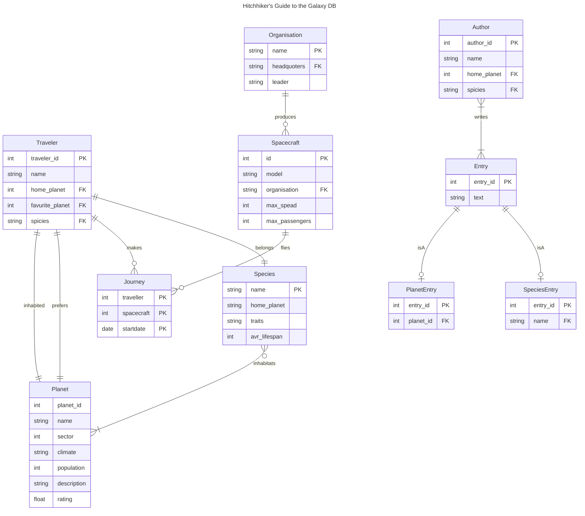

# Introduction to Databases Project

The project aims to be a simplified version of the The Hitchhiker's Guide to the Galaxy

The project was build starting from prof. Cavaleses [project requirements](https://www.inf.unibz.it/~calvanese/teaching/23-24-idb/#project).

## application domain

The HHGTTG Lore Repository will be a database designed to catalog and explore the vast universe of The Hitchhiker's Guide to the Galaxy. It serves as reference, containing entries on characters, planets and ships from the HHGTTG universe. Whether you're searching for information on the Infinite Improbability Drive or curious about the serie's characters, this repository this repository aims to collect all there is to know about rich lore of Douglas Adams' iconic universe.

## conceptual design

### requirements

1. It should be based on a domain containing between 6 and 10 main conceptual entities (i.e., without counting sub-entities that appear in ISAs or generalizations).
2. There should be some structure in the set of entities, i.e., the ER schema should in addition contain at least one ISA and at least one generalization.
3. There should be sufficient structure in the relationships, which usually means that the representation of the ER schema as a graph (where the nodes are given by the entities and relationships, and the edges are given by the participation of entities in relationships) should contain some cycles.
4. The schema should contain cardinality constraints on the participation of entities to relationships that are different from the default (0,n).
5. The schema should contain some identifiers made of multiple attributes, and at least one external identification for some entity.
6. The schema should contain at least one optional attribute and at least one multi-valued attribute.
7. There should be some external constraints, that cannot be represented in the ER model.
8. The specification should include an indication about the volumes for the various entities and relationships (pay attention to the coherence between the volumes and the cardinality constraints of the ER schema).
9. The specification should include a workload of the most common queries and operations (between 5 and 10) that are of interest in the modeled domain, with an indication of their frequency.

### glossary 

<!-- TODO -->

### diagram of the conceptual schema

### data dictionary

#### Main Entities:

Planet
- Attributes: PlanetID, Name, Sector, Climate, Population, Description, GuideRating
- Multi-valued Attribute: TouristAttractions (List of key attractions on the planet)

Species
- Attributes: Name, HomePlanet, PhysicalTraits, AverageLifespan
<!-- - Optional Attribute: LanguagesSpoken (Species may speak multiple or no languages) -->

Spacecraft
- Attributes: SpacecraftID, Model, Manufacturer, MaxSpeed, FuelType, PassengerCapacity
- Multi-valued Attribute: Amenities (List of amenities available on the spacecraft)

Traveler
- Attributes: TravelerID, Name, Species, HomePlanet, FavoritePlanet
- Optional Attribute: GuideSubscriptionLevel (Basic, Advanced, Premium)

Journey
- Attributes: JourneyID, SpacecraftID, TravelerID, OriginPlanet, DestinationPlanet, DepartureDate, ArrivalDate

KnowledgeEntry
- Attributes: EntryID, Title, Content, Author, DatePublished, Category
<!-- - Multi-valued Attribute: Keywords (Keywords associated with the entry) -->

GuideArticle
- Attributes: ArticleID, Title, PlanetID, Content, Author, DatePublished, UserRating
<!-- - Optional Attribute: SafetyRating (Some planets might not have a defined safety rating) -->

Corporation (Overseeing various enterprises and travel agencies)
- Attributes: CorporationID, Name, Headquarters, CEO, NetWorth
<!-- - Multi-valued Attribute: Subsidiaries (List of companies owned by the corporation) -->

### table of volumes and table of operations according to the foreseen application load